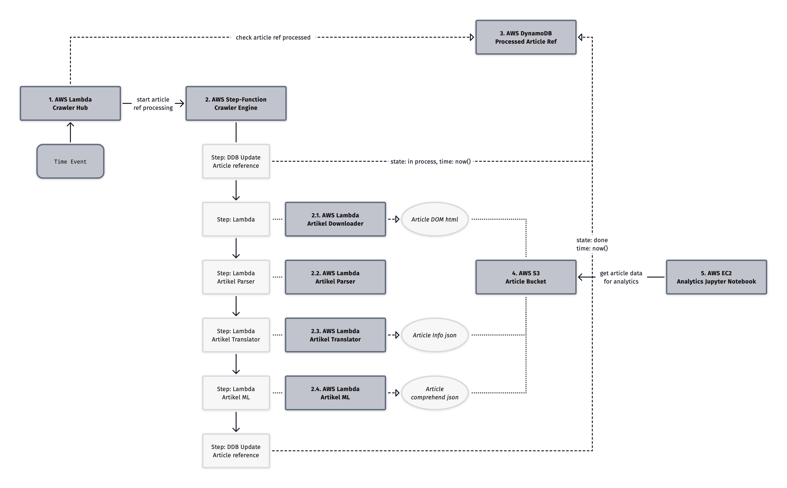

# Carly AWS

This repository contains the AWS infrastructure used in the carly project.
An architecture overview is displayed below.

## Dependencies

The project depends on the other carly projects, `carly_pkg` and `carly_lmb`.

## Project structure

The project code is found under the `internal` folder.
The file names give an idea of which part of the application is defined in them.

- In the file `internal/storage.go` are defined DynamoDB tables and S3 Buckets.
- In the file `internal/crawler-engine-lmb.go` defines the crawler-engine lambda functions. More details regarding the logic is found in the `carly_lmb`repository.
- In the file `internal/crawler-engine.go` defines the AWS StepFunction. Details regarding the process is shown in the visualization below.
- In the file `internal/crawler-hub.go` Is the crawler hub lambda function defined.
- In the file `internal/analytics-hub.go` Is the EC2 instance defined that hosts the Jupyter notebok for Analytics.

The diagram shows how the crawler processes websites. The logic is implemented in the repository `carly_lmb`. The infrastructure set up is located in the crawler files under the folder `internal`.
